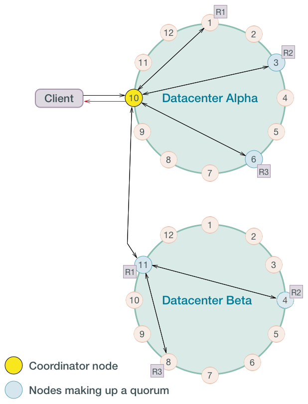

# Multiple datacenter write requests {#dmlClientRequestsMultiDCWrites .concept}

How write requests work when using multiple datacenters.

In multiple datacenter deployments, Cassandra optimizes write performance by choosing one coordinator node. The coordinator node contacted by the client application forwards the write request to one replica in each of the other datacenters, with a special tag to forward the write to the other local replicas.

If the write [consistency level](dmlAboutDataConsistency.md) is `LOCAL_ONE` or `LOCAL_QUORUM`, only the nodes in the same datacenter as the coordinator node must respond to the client request in order for the request to succeed. Use either `LOCAL_ONE` or `LOCAL_QUORUM` to reduce geographical latency lessen the impact on client write request response times.

 

**Parent topic:** [How are write requests accomplished?](../../cassandra/dml/dmlClientRequestsWrite.md)

